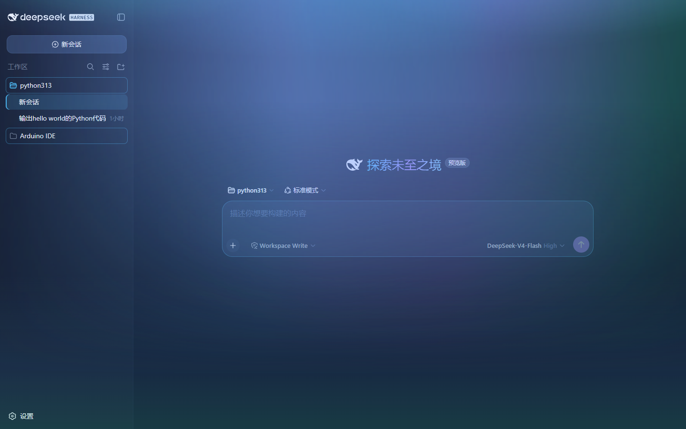
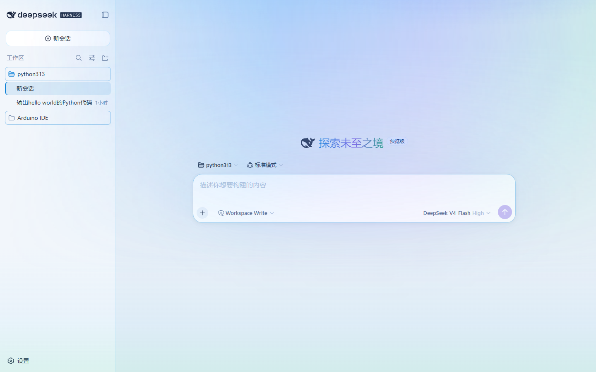

# dsh-skin-aurora · 极光

DeepSeek Harness Web GUI 的极光主题皮肤。以近黑蓝夜空为基底，双层极光光带流动于页面上方，配色遵循"单主色 + 低饱和辅助色"的克制原则，兼顾视觉氛围与阅读体验。

## 特性

**动态极光**
- 双层光带以不同周期（14s / 9s）错位流动，青蓝 → 紫 → 绿三色渐变
- 页面顶部光晕与底部极光绿反光，形成"天空—地面"的空间呼应

**内容呈现**
- 欢迎页主标题极光渐变文字
- 代码块极光语法着色（shiki token 主题：关键字 / 字符串 / 注释分类配色）
- 深色与浅色双主题，成功 / 警告 / 错误等语义色全部重新映射

**界面细节**
- 侧栏蓝紫渐变、选中项指示条、项目行描边
- 卡片悬浮描边发光、输入框聚焦光效

**无障碍**
- 遵循 `prefers-reduced-motion`，系统启用"减少动态效果"时自动停止动画

## 效果预览

| 深色模式 | 浅色模式 |
|---|---|
|  |  |

## 安装

```sh
git clone https://github.com/Canye-zdm/dsh-skin-aurora
cd <dsh 安装目录>
dsh plugin --profile web add <dsh-skin-aurora 目录路径>
```

安装完成后重启 `dsh web`（先 `Ctrl + C` 停掉旧实例），访问 `http://127.0.0.1:3080` 即可。

### Windows 平台说明

若安装时出现 `declares no dsh.bundle` 警告，系 pnpm 未自动创建包链接所致。手动建立目录联接（Junction）后重新安装即可：

```powershell
New-Item -ItemType Junction -Path "$env:USERPROFILE\.dsh\profiles\web\node_modules\dsh-client-ui-skin-aurora" -Target "<dsh-skin-aurora 目录路径>"
dsh plugin --profile web add <dsh-skin-aurora 目录路径>
```

## 卸载

```sh
dsh plugin --profile web remove dsh-client-ui-skin-aurora
```

重启 `dsh web` 后界面恢复官方主题，皮肤不保留任何残留。

## 许可

[MIT](LICENSE) © 2026 [Canye-zdm](https://github.com/Canye-zdm)
